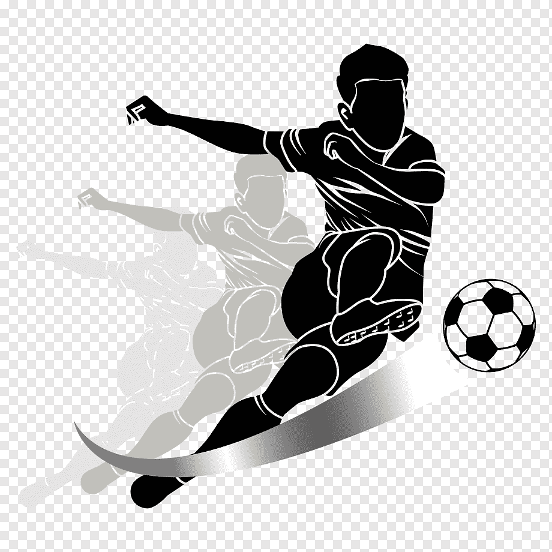

# CPA_shinyR

[](https://github.com/rakiiibul/spa-app/graphs/contributors) [](https://github.com/rakiiibul/spa-app/network/members) [](https://github.com/rakiiibul/spa-app/stargazers) [](https://github.com/rakiiibul/spa-app/issues) [](https://github.com/rakiiibul/spa-app/blob/master/LICENSE)
<div id="top"></div>
<div align="center">
<a href="https://github.com/rakiiibul/spa-app">
</a>

<h2 align="center">

Soccer Player Attributes

</h2>

<p align="center">

with R Program Language <br />\
<a href="https://github.com/rakiiibul/spa-app/issues">Report
Bug</a> ·
<a href="https://github.com/rakiiibul/spa-app/issues">Request
Feature</a>

</p>
</div>

<!-- TABLE OF CONTENTS -->

<details>

<summary>Table of Contents</summary>

<ol>

<li>

<a href="#about-the-project">About The Project</a>

<ul>

<li><a href="#built-with">Built With R </a></li>

</ul>

</li>

<li>

<a href="#getting-started">Getting Started</a>

<ul>

</li>
<li><a href="#roadmap">Roadmap</a></li>

<li><a href="#license">License</a></li>

<li><a href="#contact">Contact</a></li>

<li><a href="#acknowledgments">Acknowledgments</a></li>

</ol>

</details>

<!-- ABOUT THE PROJECT -->

## About The Project

</a>

### Context

#### Problem Statement

Football, more commonly known as soccer, is a team sport played between
two teams of 11 players who primarily use their feet to propel the ball
around a rectangular field called a pitch.

The FIFA ***World Cup Qatar*** 2022™ has been played from 20 November to
18 December. So basically its Soccer season. The excitement for football
is very high to everyone. In this workshop, we explore the soccer player
attributes. We explore single player attributes, compare 1 player
attributes to another and also see top n player attributes in the radar
plot.

**About this Dataset**

## **The ultimate Soccer database for data analysis**

-   +25,000 matches

-   +10,000 players

-   11 European Countries with their lead championship

-   Seasons 2008 to 2016

-   Players and Teams' attributes\* sourced from EA Sports' FIFA video
    game series, including the weekly updates

-   Team line up with squad formation (X, Y coordinates)

-   Betting odds from up to 10 providers

-   Detailed match events (goal types, possession, corner, cross, fouls,
    cards etc...) for +10,000 matches

## RadarChart
The Radar Chart, also sometimes called a spider or star chart, we can compare multiple items against multiple criteria.
In this application we use radarchart to see the player statistics.

## Single player Attributes
The one-player attributes are individual data that measure player abilities on a scale from 1 to 100. There are 33 different criterias you can see in the radar chart. For having a graphical view of one player attributes first you need to select the "single player" option from left side of the window. Then you can choose your player from the list of the player and you will see the graph of his skill which part fill the color. 

## 1 VS 1
This 1 vs 1 option allows us to compare two-player stats. It will choose one color for the first chosen player and another different color for the second player. So you can compare two player attributes and can understand which player is good with specific skills.

## Top n player
We show you the top n ratings of the best players in 2016. How good are Messi, Ronaldo, Neymar, and the rest of world football's elite? Here you can choose a minimum of 3 players and a maximum top 50 players to visualize their attributes and on the right side, you can see the list of players.  

<p align="right">

(<a href="#top">back to top</a>)

</p>

### Built With

-   [R](https://www.r-project.org/)

    <p align="right">

    (<a href="#top">back to top</a>)

    </p>

<!-- GETTING STARTED -->

## Getting Started

To run this workshop, you can go with three different mode:
-   Visitor mode(You just want to see the project, just visit website )
-   Development Mode( if you want to run the workshop and modify it in
    R)  
-   Production mode( You want to run it with docker in your own machine)

## Visitor Mode
This application has been published. So just (<a href="https://therakiiibul.shinyapps.io/spa-app">click here</a>) to visit the application with your default browser.
Or you can copy the link and browse with your desire browser.
```
https://therakiiibul.shinyapps.io/spa-app/
```

## Production Mode

In this case, You want to run the application in your own environment.The production environment of this project is encapsulated in a Docker container.

1. #### Prerequisites
#### Tools
- Docker

Install Docker. Follow the instructions on https://docs.docker.com/install/  

2. Clone the git repository
``` 
git clone git@github.com:rakiiibul/spa-app.git
```

3. Go to project folder and build the docker image 

**As the dataset for this app is huge I compressed the dataset.You can simlpy find it in app folder you just need to extract the zip file.**

```
docker build -t spa-app .
```
4. The installation will take a few minutes. 
Run the docker Image
```
docker run -d --rm -p 3838:3838 spa-app
```

5. Now open a browser and go to this below link :
```
http://localhost:3838/
```
Congratulation! You have successfully run it in your own machine.

## Development Mode
#### 1. Prerequisites

#### Tools
-   R
-   R Studio

2. ### Installation

``` sh
git clone https://github.com/rakiiibul/spa-app.git
```

3. ### Install library      
open the project in R studio.
you can install all necessary library from the renv file.
for this you need to type following commands in R console.
```
    renv::install()
    renv::restore()
```
Or you can install these library one by one.(skip this part if you install it from renv.
#### Library

-   shiny

<!-- -->

        install.packages('shiny')

-   tibble

<!-- -->

        install.packages("tibble")

-   dplyr

<!-- -->

        install.packages("dplyr")

-   radarchart

<!-- -->

        install.packages("radarchart")

-   tidyr

<!-- -->

        install.packages("tidyr")

-   DT

<!-- -->

        install.packages("DT")

-   fmsb

<!-- -->

        install.packages("fmsb")


4. Run the App     
**As the dataset for this app is huge I compressed the dataset.You can simlpy find it in app folder you just need to extract the zip file.**
After completing the installation of these library open app.r file in the r studio and click on run/play button to run it.

or type the bellow command in R console.

```
shiny::runApp('app')
```
If you follow all the previous step correctly, A new pop screen will show,where you can find the view of this view.


<p align="right">

(<a href="#top">back to top</a>)

</p>

<!-- ROADMAP -->

## Roadmap

-   [x] Description Of Data
-   [x] Data Preprocessing
-   [x] Radarchart
-   [x] Single player Attributes
-   [x] 1 vs 1 player Attributes
-   [x] Top n player Attributes


<p align="right">

(<a href="#top">back to top</a>)

</p>

<!-- LICENSE -->

## License

Distributed under the MIT License. See `LICENSE` for more information.

<p align="right">

(<a href="#top">back to top</a>)

</p>

<!-- CONTACT -->

## Contact

Project Link: <https://github.com/rakiiibul/PAnSA_shinyR>

<p align="right">

(<a href="#top">back to top</a>)

</p>

<!-- ACKNOWLEDGMENTS -->

## Acknowledgments

The data was sourced from:

<http://football-data.mx-api.enetscores.com/> : scores, lineup, team
formation and events

<http://www.football-data.co.uk/> : betting odds. Click here to
understand the column naming system for betting odds:

<http://sofifa.com/> : players and teams attributes from EA Sports FIFA
games. FIFA series and all FIFA assets property of EA Sports.

Image generate from <https://deepai.org/>

<p align="right">

(<a href="#top">back to top</a>)

</p>
If you like this application don’t forget to give the star.

Happy Coding :) !!!
<!-- MARKDOWN LINKS & IMAGES -->

<!-- https://www.markdownguide.org/basic-syntax/#reference-style-links -->
